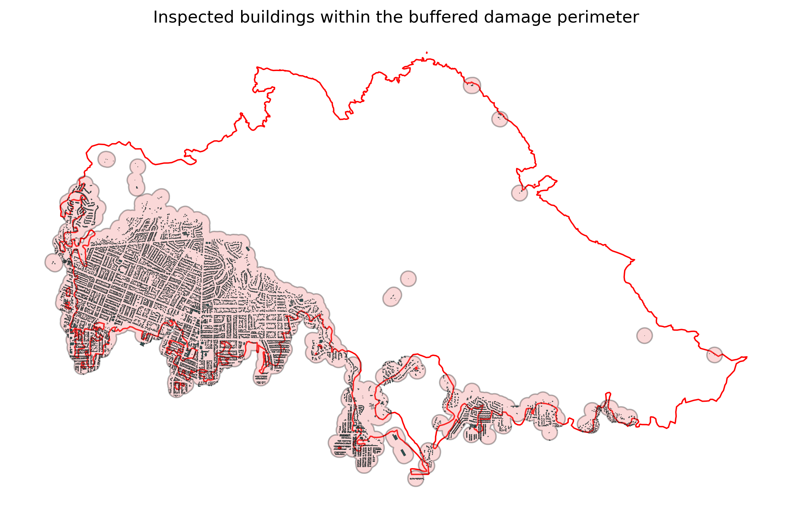

# Buildings in the 2025 Eaton Fire zone
This program produces two GeoJSON files.  One contains the 150-meter buffered footprints of the damaged buildings.  Another contains polygon-type building footprint data along with damage inspection information, all within the buffered damage perimeter. We will describe them more precisely below.  These outputs are all derived data from [[1]](#1).

## Data Sources
1. **Buildings_2023_with_DINS** [[1]](#1).
This dataset contains building footprints within and near the 2025 Eaton and Palisades fire perimeters, and it integrates Damage Inspection (DINS) data from CalFIRE.

2. **Eaton Fire Perimeter**  [[2]](#2).
  This dataset contains the Eaton fire perimeter and we actually only use it for visualization purposes in this project.  Note that this perimeter is not completely accurate.  In particular, some of the clearly burnt areas are not included within the fire perimeter; for example, the fire perimeter cuts through the middle of some buildings that were completely destroyed. 
   
## Files and Features
1. `buildings_request_derivation.ipynb`:  
      This Jupyter Notebook accomplishes the following tasks.
    - Access the LA County Buildings_2023_with_DINS data via ArcGIS REST API.
    - As the dataset above contains the Palisades area as well, we exclude that and only retain buildings in the greater Eaton area.
    - Exclude buildings labeled as "Uninspected" or "Inaccessible", so only retain inspected buildings.  This exclusion is sensible because most such buildings are located outside of the fire perimeter, typically beyond a layer of inspected buildings marked as "No Damage".  As such, they are unlikely to contribute meaningfully to fire damage analysis.  Furthermore, there are very few uninspected buildings within the fire perimenter, most of which are minor side structures adjacent to inspected buildings. Therefore, excluding them is unlikely to significantly affect the analysis of building damage.
    - Creates the two `.geojson` files below.
      
2. `eaton_buffered_damage_perimeter.geojson`:  
    This is the output GeoJSON file (285 KB). The Coordinate Reference System (CRS) is `EPSG:26911`, which corresponds to UTM Zone 11N containing Los Angeles County, and it uses meters as units, making it suitable for distance-based modeling.  It represents the 150-meter buffered footprints of the damaged buildings. The buffer size of 150 meters (approximately 500 feet) was chosen based on several considerations: the typical extent of fire impact, the median length of a city block, and the scale of neighborhoods containing a mix of damaged and undamaged buildings. This buffer allows for analysis of spatial patterns at a meaningful neighborhood scale. There are 9899 damaged buildings.  The area within this perimeter is about 20.13 square kilometers.  We will refer to this perimeter as the *buffered damage perimeter*.

3. `eaton_buildings_study.geojson`:  
     This is the output GeoJSON file (18.6 MB). The Coordinate Reference System (CRS) is `EPSG:26911`.  It contains polygon-type footprint data along with damage inspection information for all inspected buildings within the buffered damage perimeter.  It contains 17265 buildings.

## Visualization
Below is a rough plot of the buildings in the `eaton_buildings_study.geojson`. The fire perimeter is outlined in red color.  The area within the buffered damage perimeter is filled with lightcoral color.  

  
## Technologies
-  `Python`
-  `requests`
- `geopandas`
- `shapely`
- `matplotlib`

## License
This project is licensed under the MIT License — see the [LICENSE](LICENSE) file for details.

## Data Attribution

This repository includes geospatial data obtained from the Los Angeles County Enterprise GIS Hub. The data is provided by Los Angeles County and is subject to the [Los Angeles County Open Data Terms of Use](https://egis-lacounty.hub.arcgis.com/pages/terms-of-use). Please review the terms for any restrictions on use, redistribution, or attribution. For more information, visit the [LA County Enterprise GIS Hub](https://egis-lacounty.hub.arcgis.com/).

## References
1.  County of Los Angeles, California, Enterprise GIS Repository. [Buildings 2023 with DINS](https://services.arcgis.com/RmCCgQtiZLDCtblq/ArcGIS/rest/services/Buildings_2023_with_DINS/FeatureServer/4)
2.  County of Los Angeles, California, Enterprise GIS Repository. [Eaton Fire Perimeter](https://egis-lacounty.hub.arcgis.com/maps/ad51845ea5fb4eb483bc2a7c38b2370c/about)

